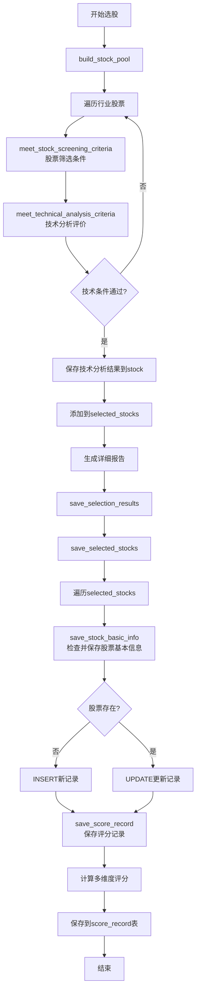

# 选股技能逻辑检查报告

## 检查目标
1. 选股技能，要求选股的同时对股票评价
2. 股票评价之前，要检查stock_basic_info是否有对应股票信息，没有需要先新增

---

## 检查结果

### 逻辑1：选股的同时对股票评价 ✅ 已实现

#### 实现位置
- **文件**: `skills/stock_selection_skill.py`

#### 实现细节

**1. 选股过程中的技术分析评价**
- **函数**: `build_stock_pool()` (第809-930行)
- **流程**:
  ```python
  # 检查是否符合技术分析条件
  technical_result = meet_technical_analysis_criteria(stock)
  if not technical_result['passed']:
      continue
  
  # 保存技术分析结果
  stock['technical_analysis_result'] = technical_result
  ```

**2. 技术分析评价函数**
- **函数**: `meet_technical_analysis_criteria()` (第683-807行)
- **评价内容**:
  - 均线系统：股价站稳20日均线且M20向上
  - 成交量：当日成交量＞5日/60日均量，换手率5%-20%
  - 趋势指标：MACD金叉，DIFF＞DEA＞0
  - 资金指标：OBV＞MAOBV且持续上行
  - 布林线：股价位于上轨和中轨之间

**3. 详细报告生成**
- **函数**: `generate_detailed_report()` (第1054-1373行)
- **评价内容**:
  - 技术面分析（含各项指标得分）
  - 基本面分析
  - 政策面分析
  - 最近五天股价

**4. 多维度评分计算**
- **函数**: `save_score_record()` (第1560-1762行)
- **评分维度**:
  - 技术面评分（100分制）
  - 基本面评分（使用MultiDimensionScoring）
  - 消息面评分（使用MultiDimensionScoring）
  - 政策面评分（使用MultiDimensionScoring）
  - 减项扣分（使用MultiDimensionScoring）
  - 综合评分计算

---

### 逻辑2：评价前检查并新增stock_basic_info ✅ 已实现

#### 实现位置
- **文件**: `skills/stock_selection_skill.py`
- **类**: `StockSelectionDB`

#### 实现细节

**1. 保存流程**
- **函数**: `save_selected_stocks()` (第1832-1857行)
- **流程**:
  ```python
  for stock in selected_stocks:
      # 1. 先保存股票基本信息
      if self.save_stock_basic_info(stock):
          # 2. 再保存评分记录
          technical_result = stock.get('technical_analysis_result', {})
          if self.save_score_record(stock, technical_result):
              success_count += 1
  ```

**2. 股票基本信息保存逻辑**
- **函数**: `save_stock_basic_info()` (第1487-1558行)
- **流程**:
  ```python
  # 检查股票是否已存在
  cursor.execute('''
      SELECT id FROM stock_basic_info WHERE stock_code = ?
  ''', (stock_code,))
  
  if cursor.fetchone() is None:
      # 不存在则插入
      cursor.execute('''
          INSERT INTO stock_basic_info 
          (stock_code, stock_name, exchange, industry, sector, status, create_time, update_time)
          VALUES (?, ?, ?, ?, ?, ?, ?, ?)
      ''', (...))
  else:
      # 已存在则更新
      cursor.execute('''
          UPDATE stock_basic_info 
          SET stock_name = ?, exchange = ?, industry = ?, sector = ?, update_time = ?
          WHERE stock_code = ?
      ''', (...))
  ```

**3. 数据库表结构**
- **表名**: `stock_basic_info`
- **字段**:
  - `stock_code`: 股票代码
  - `stock_name`: 股票名称
  - `exchange`: 交易所（SH/SZ）
  - `industry`: 所属行业
  - `sector`: 所属板块
  - `status`: 状态
  - `create_time`: 创建时间
  - `update_time`: 更新时间

---

## 流程图



---

## 结论

| 逻辑 | 状态 | 实现位置 |
|------|------|---------|
| 选股的同时对股票评价 | ✅ 已实现 | `build_stock_pool()` + `meet_technical_analysis_criteria()` + `generate_detailed_report()` |
| 评价前检查并新增stock_basic_info | ✅ 已实现 | `save_selected_stocks()` + `save_stock_basic_info()` |

**两个逻辑均已正确实现，代码逻辑清晰，流程完整。**

---

## 检查时间
2026-02-20
