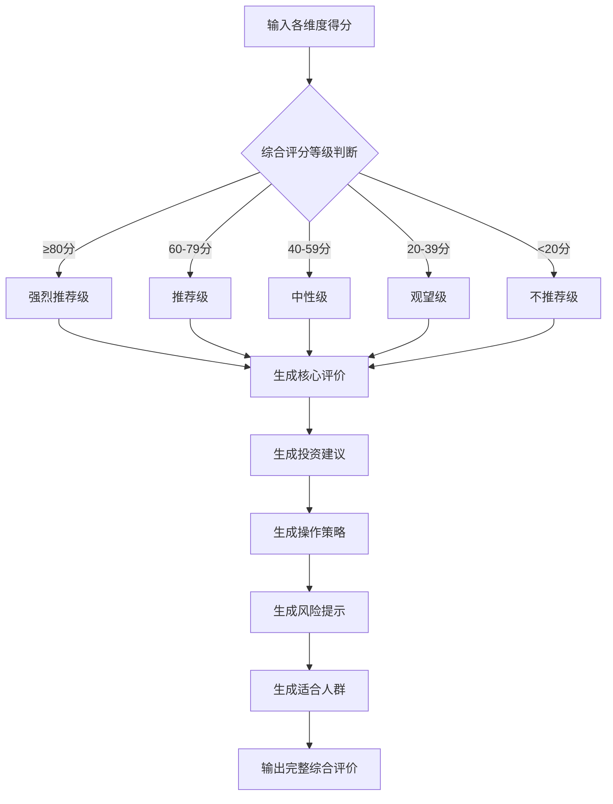

# 综合评价增强计划

## 一、需求对齐

### 1.1 当前问题
当前的综合评价（`_generate_summary`方法）过于简单，仅拼接各维度得分描述，缺少：
- 具体的投资建议
- 风险提示
- 操作策略建议
- 适合的投资者类型
- 持仓周期建议

### 1.2 目标
增强综合评价内容，使其更加丰富、专业，为投资者提供有价值的参考信息。

### 1.3 Out of Scope
- 不修改评分算法
- 不修改前端展示结构（仅增加内容丰富度）
- 不修改数据库结构

## 二、架构设计

### 2.1 设计思路
将综合评价拆分为以下几个模块：

```
综合评价
├── 核心评价（技术面+基本面综合分析）
├── 投资建议（买入/持有/观望/卖出）
├── 操作策略（短线/中线/长线建议）
├── 风险提示（主要风险点）
└── 适合人群（投资者类型建议）
```

### 2.2 核心流程图



### 2.3 评价维度权重

| 维度 | 权重 | 说明 |
|------|------|------|
| 技术面 | 50% | 短期走势判断依据 |
| 基本面 | 50% | 中长期价值判断依据 |
| 消息面 | 加减分 | 短期情绪影响 |
| 政策面 | 加减分 | 行业政策影响 |
| 减项扣分 | 扣分 | 风险因素 |

## 三、任务拆分

### 任务1: 增强核心评价生成逻辑
- **工作量**: 2小时
- **验收标准**: 
  - 根据技术面和基本面得分，生成更详细的评价文本
  - 包含趋势判断、估值判断等具体内容

### 任务2: 添加投资建议生成逻辑
- **工作量**: 1小时
- **验收标准**:
  - 根据综合评分和各维度得分，生成明确的投资建议
  - 建议包含：买入/持有/观望/卖出

### 任务3: 添加操作策略生成逻辑
- **工作量**: 1小时
- **验收标准**:
  - 根据技术面和基本面特点，给出操作策略
  - 包含：短线/中线/长线建议，仓位控制建议

### 任务4: 添加风险提示生成逻辑
- **工作量**: 1小时
- **验收标准**:
  - 根据减项扣分和各维度弱点，生成风险提示
  - 提示包含：主要风险点、注意事项

### 任务5: 添加适合人群建议
- **工作量**: 0.5小时
- **验收标准**:
  - 根据股票特点，建议适合的投资者类型
  - 包含：激进型/稳健型/保守型

### 任务6: 整合测试验证
- **工作量**: 1.5小时
- **验收标准**:
  - 使用东华软件(002065)和茅台(600519)进行端到端测试
  - 验证综合评价内容丰富、逻辑合理

## 四、代码修改位置

### 4.1 主要修改文件
- `d:\workspace\quantitative_stock_trading\skills\stock_selection_skill.py`
  - 修改 `_generate_summary` 方法（第1785-1830行）
  - 新增 `_generate_core_evaluation` 方法
  - 新增 `_generate_investment_advice` 方法
  - 新增 `_generate_operation_strategy` 方法
  - 新增 `_generate_risk_warning` 方法
  - 新增 `_generate_suitable_investors` 方法

### 4.2 方法签名设计

```python
def _generate_summary(self, tech_score, fund_score, news_score, policy_score, deduct_score, stock_name="", stock_code=""):
    """
    生成综合评价（增强版）
    
    Returns:
        str: 包含核心评价、投资建议、操作策略、风险提示、适合人群的完整评价
    """

def _generate_core_evaluation(self, tech_score, fund_score, news_score, policy_score, deduct_score):
    """生成核心评价"""
    
def _generate_investment_advice(self, total_score, tech_score, fund_score):
    """生成投资建议"""
    
def _generate_operation_strategy(self, tech_score, fund_score):
    """生成操作策略"""
    
def _generate_risk_warning(self, deduct_score, tech_score, fund_score):
    """生成风险提示"""
    
def _generate_suitable_investors(self, total_score, tech_score, fund_score):
    """生成适合人群建议"""
```

## 五、评价内容示例

### 5.1 强烈推荐级（≥80分）
```
【核心评价】
技术面优秀(85分)，均线多头排列，MACD金叉确认，成交量放大，短期趋势强劲；基本面良好(72分)，估值合理，盈利能力稳定。综合来看，该股具备较好的投资价值。

【投资建议】★★★★★
建议：积极买入
理由：技术面与基本面共振向上，短期动能充足，中长期价值支撑明确。

【操作策略】
• 短线策略：可积极参与，关注5日均线支撑，跌破则减仓
• 中线策略：持有为主，目标看前期高点，止损设在20日均线
• 仓位建议：可配置总仓位的20%-30%

【风险提示】
• 需关注成交量变化，若持续缩量需警惕
• 注意大盘系统性风险

【适合人群】
适合稳健型及以上投资者，建议有一定技术分析基础的投资者参与。
```

### 5.2 推荐级（60-79分）
```
【核心评价】
技术面良好(68分)，走势相对稳健，均线系统趋于多头；基本面一般(55分)，估值处于合理区间。整体来看，该股具有一定的投资机会。

【投资建议】★★★★☆
建议：逢低买入
理由：技术面尚可，基本面支撑一般，建议等待回调机会再介入。

【操作策略】
• 短线策略：观望为主，等待回调至支撑位再介入
• 中线策略：可小仓位试探，确认趋势后再加仓
• 仓位建议：建议控制在总仓位的10%-20%

【风险提示】
• 基本面支撑不够强劲，需关注业绩变化
• 技术面若转弱需及时止损

【适合人群】
适合稳健型投资者，建议有风险承受能力的投资者参与。
```

### 5.3 中性级（40-59分）
```
【核心评价】
技术面一般(45分)，趋势尚不明朗，需关注方向选择；基本面较弱(38分)，估值偏高。建议谨慎观望。

【投资建议】★★★☆☆
建议：持有观望
理由：多空因素交织，建议等待更明确的信号再决策。

【操作策略】
• 短线策略：不建议追高，观望为主
• 中线策略：若持有可继续持有，但不建议加仓
• 仓位建议：建议控制在总仓位的5%-10%

【风险提示】
• 技术面趋势不明，存在回调风险
• 基本面偏弱，需警惕业绩不及预期

【适合人群】
适合保守型投资者观望，不建议激进投资者重仓参与。
```

### 5.4 观望级（20-39分）
```
【核心评价】
技术面较弱(28分)，短期走势承压，均线空头排列；基本面一般(35分)。建议暂时回避。

【投资建议】★★☆☆☆
建议：暂不介入
理由：技术面走弱，缺乏明确的买入信号，建议等待企稳后再考虑。

【操作策略】
• 短线策略：不建议参与
• 中线策略：观望等待，关注是否出现底部信号
• 仓位建议：不建议配置

【风险提示】
• 技术面走弱，存在继续下跌风险
• 需等待趋势反转信号

【适合人群】
暂不建议普通投资者参与，仅适合专业投资者进行左侧交易。
```

### 5.5 不推荐级（<20分）
```
【核心评价】
技术面极弱(15分)，趋势严重走坏；基本面较差(12分)，估值过高或业绩下滑。强烈建议回避。

【投资建议】★☆☆☆☆
建议：回避
理由：技术面与基本面双重走弱，风险大于机会。

【操作策略】
• 短线策略：不建议参与
• 中线策略：不建议参与
• 仓位建议：不建议配置

【风险提示】
• 技术面严重走弱，存在大幅下跌风险
• 基本面问题较多，需警惕业绩暴雷
• 若持有建议止损离场

【适合人群】
不建议任何类型投资者参与。
```

## 六、测试方案

### 6.1 测试用例
| 股票 | 预期评分区间 | 预期建议 |
|------|--------------|----------|
| 茅台(600519) | 60-80 | 推荐级 |
| 东华软件(002065) | 40-60 | 中性级 |
| 鼎捷数智(300378) | 待评估 | 待验证 |

### 6.2 验收标准
1. 综合评价包含5个模块（核心评价、投资建议、操作策略、风险提示、适合人群）
2. 内容逻辑合理，与评分等级匹配
3. 前端正确显示增强后的综合评价

## 七、智能体协同

| 任务 | 负责智能体 |
|------|------------|
| 需求分析与设计 | 主智能体 |
| 代码实现 | 后端工程师智能体 |
| 端到端测试 | 测试工程师智能体 |

---

**计划状态**: 待审批
**创建时间**: 2026-02-20
