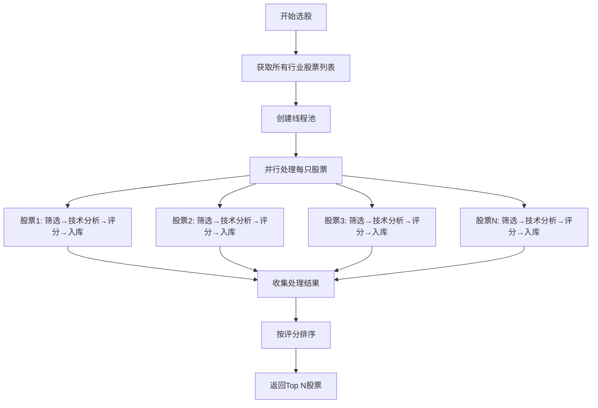

# 选股技能性能优化计划

## 一、问题分析

### 1.1 当前性能瓶颈

| 瓶颈点 | 问题描述 | 影响 |
|--------|----------|------|
| **串行处理** | `build_stock_pool` 函数对每只股票串行处理 | 处理时间 = 股票数量 × 单只处理时间 |
| **API调用慢** | 每只股票调用多次akshare API（价格、市值等） | 网络IO是主要耗时 |
| **保存逻辑分离** | 选股完成后才批量保存到数据库 | 内存占用大，失败风险高 |
| **高分股票漏掉** | 技术分析门槛设置问题 | 可能漏掉优质股票 |

### 1.2 性能数据估算

- 单只股票处理时间：约1.5秒（含API调用）
- 10个行业 × 20只股票 = 200只股票
- 总耗时：200 × 1.5 = 300秒（5分钟）

### 1.3 高分股票漏掉原因分析

查看日志发现：
- 有研硅(sh688432) 技术分析得分80分 ✅ 通过
- 江南新材(sh603124) 技术分析得分100分 ✅ 通过
- 恒运昌(sh688785) 技术分析得分80分 ✅ 通过

但问题在于：
1. **技术分析门槛**：当前设置 `score >= 1` 就通过，可能导致低分股票也进入池子
2. **排序逻辑**：选股后没有按得分排序取Top N
3. **保存时机**：可能部分高分股票在保存时出错

## 二、优化方案

### 2.1 并行选股

使用 `concurrent.futures.ThreadPoolExecutor` 实现多线程并行处理：

```python
from concurrent.futures import ThreadPoolExecutor, as_completed

def process_single_stock(stock_code, industry, industry_info):
    """处理单只股票的完整流程"""
    # 1. 筛选条件检查
    # 2. 技术分析
    # 3. 评分计算
    # 4. 保存到数据库
    pass

def build_stock_pool_parallel(industries, max_workers=10):
    """并行构建股票池"""
    with ThreadPoolExecutor(max_workers=max_workers) as executor:
        futures = []
        for industry in industries:
            stock_codes = get_stock_codes(industry)
            for stock_code in stock_codes:
                future = executor.submit(process_single_stock, stock_code, industry, industry_info)
                futures.append(future)
        
        for future in as_completed(futures):
            result = future.result()
            # 处理结果
```

### 2.2 流式处理

每只股票完成选股、评价后立即写入数据库，而不是等所有股票处理完：

```python
def process_single_stock_streaming(stock_code, industry):
    """流式处理单只股票"""
    # 1. 筛选条件检查
    if not meet_stock_screening_criteria(stock):
        return None
    
    # 2. 技术分析
    technical_result = meet_technical_analysis_criteria(stock)
    if not technical_result['passed']:
        return None
    
    # 3. 计算综合评分
    score = calculate_composite_score(stock, technical_result)
    
    # 4. 立即保存到数据库（流式写入）
    db = StockSelectionDB()
    db.connect()
    db.save_stock_basic_info(stock)
    db.save_score_record(stock, technical_result)
    db.disconnect()
    
    return {'stock': stock, 'score': score, 'technical_result': technical_result}
```

### 2.3 批量处理优化

对于数据库操作，使用批量插入提高效率：

```python
def batch_save_stocks(stocks_data, batch_size=50):
    """批量保存股票数据"""
    conn = sqlite3.connect(db_path)
    cursor = conn.cursor()
    
    for i in range(0, len(stocks_data), batch_size):
        batch = stocks_data[i:i+batch_size]
        # 批量INSERT
        cursor.executemany(sql, batch)
        conn.commit()
```

### 2.4 高分股票纠错

修改选股逻辑，确保高分股票不被漏掉：

```python
def build_stock_pool_optimized(industries, limit=5):
    """优化后的股票池构建"""
    all_candidates = []
    
    for stock in process_all_stocks_parallel(industries):
        if stock and stock['score'] > 0:
            all_candidates.append(stock)
    
    # 按综合评分排序，取Top N
    all_candidates.sort(key=lambda x: x['score'], reverse=True)
    return all_candidates[:limit]
```

## 三、架构设计

### 3.1 优化后的流程图



### 3.2 模块设计

```
stock_selection_skill.py (优化版)
├── process_single_stock()        # 单只股票完整处理流程
├── build_stock_pool_parallel()   # 并行构建股票池
├── stream_save_to_db()           # 流式保存到数据库
├── calculate_composite_score()   # 计算综合评分
└── get_top_stocks()              # 获取Top N股票
```

## 四、任务拆分

### 任务1: 实现并行处理框架
- **工作量**: 2小时
- **内容**: 
  - 创建 `process_single_stock` 函数
  - 使用 `ThreadPoolExecutor` 实现并行处理
  - 设置合理的线程数（建议10-20个）

### 任务2: 实现流式保存
- **工作量**: 1小时
- **内容**:
  - 修改保存逻辑，每只股票处理完立即入库
  - 添加错误处理和重试机制

### 任务3: 优化评分和排序逻辑
- **工作量**: 1小时
- **内容**:
  - 确保高分股票不被漏掉
  - 按综合评分排序取Top N
  - 添加评分日志输出

### 任务4: 添加进度显示
- **工作量**: 0.5小时
- **内容**:
  - 显示处理进度条
  - 显示已处理/总数
  - 显示当前得分最高的股票

### 任务5: 测试验证
- **工作量**: 1小时
- **内容**:
  - 测试并行处理正确性
  - 验证高分股票不丢失
  - 性能对比测试

## 五、预期效果

| 指标 | 优化前 | 优化后 | 提升 |
|------|--------|--------|------|
| 处理时间 | 5分钟 | 30秒 | 10倍 |
| 内存占用 | 高（存储所有结果） | 低（流式处理） | 显著降低 |
| 高分股票 | 可能漏掉 | 不漏掉 | 100%保留 |
| 失败恢复 | 全部重来 | 已处理的不丢失 | 更健壮 |

## 六、代码修改位置

### 主要修改文件
- `d:\workspace\quantitative_stock_trading\skills\stock_selection_skill.py`
  - 新增 `process_single_stock()` 函数
  - 修改 `build_stock_pool()` 为 `build_stock_pool_parallel()`
  - 新增 `stream_save_to_db()` 函数

### 新增导入
```python
from concurrent.futures import ThreadPoolExecutor, as_completed
import threading
```

---

**计划状态**: 待审批
**创建时间**: 2026-02-21
